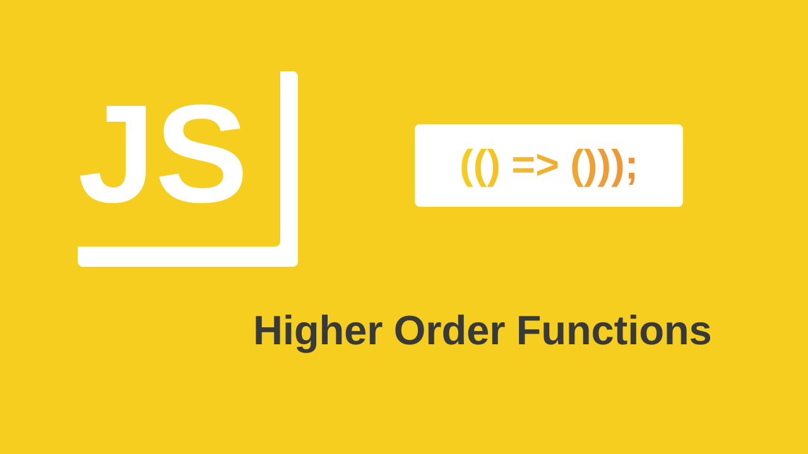

### As funções de ordem superior (Higher Order Functions), nos permitem personalizar o chamado de funções, podemos otimizar as funções retornando funções para variáveis, chamando funções de funções, passar funções como parâmetro, tudo isso utilizando funções de ordem superior, currying e closures

### ---------- Higher Order Functions ----------

- **São funções que operam sobre outras funções. seja tomando-as como argumentos ou devolvendo-as, são chamadas de funções de ordem superior.**

- **Funções de ordem superior são funções que aceitam outra função como argumento, retornam outra função como resultado, ou ambas.**

- **Um dos principais benefícios das funções de ordem superior é que elas nos permitem personalizar a maneira como chamamos nossas funções.**

```javascript
// sem higher order function
const multiply = (a, b) => {
  return a * b;
};

// estamos repetindo o 2
multiply(2, 3);
multiply(2, 4);
multiply(2, 5);

// utilizando Higher Order Functions
const multiply = (m) => {
  return (n) => {
    return n * m;
  };
};
const num = multiply(2);

console.log(num(2));
console.log(num(3));
console.log(num(4));
```

---

```javascript
// passando uma função como parâmetro
const sum = (arr, test) => {
  return arr.reduce((acc, cur) => acc * test(cur));
};

const res = sum([1, 2, 3], (n) => n * 2);
console.log(res); // -> 24
```

---

```javascript
const greatFunction = (number) => {
  return (greatThan) => greatThan * number;
};
const greatThan = greatFunction(2);
console.log(greatThan(6));
```

---

```js
function noisy(fun) {
  return function (...args) {
    console.log(`calling with ${args}`);
    let result = fun(...args);
    console.log(`called with ${args}, returned ${result}`);
    return result;
  };
}
const great = noisy(Math.max);
console.log(great(3, 2, 1));
```

---

```js
["A", "B"].forEach((l) => console.log(l));
```

### ---------- Closures ----------

1. **Funções podem ser atribuídas a variáveis**
2. **Funções podem ser passadas como argumentos para outras funções**
3. **Funções podem retornar outras funções**

```javascript
// functions can be assigned to variables
const morningGreetings = (name) => {
  console.log(`Good morning ${name}`);
};

const eveningGreeting = function (name) {
  console.log(`Good evening ${name}`);
};

// functions can be passed as arguments to other functions
const todaysGreeting = (morningGreetings, eveningGreeting) => {
  morningGreetings("Barack");
  console.log(`Thanks for all you have done during the day`);
  eveningGreeting("Barack");
};

// functions can return other functions
function myCounter() {
  let count = 0;
  return function () {
    return ++count;
  };
}

const noOfTimes = myCounter();
console.log(noOfTimes()); // 1
```

- **Uma Closure é uma referência a uma variável declarada no escopo de outra função que é mantida ativa, retornando uma nova função a partir da invocação da função existente.**

```javascript
function outerScope(a) {
  const outside = "i am outside";
  return function innerScope(b) {
    const inside = "i am inside";
    console.log(`innerScope ➡ ${inside}: ${a + b}`);
    console.log(`outerScope ➡ ${outside}: ${a + b}`);
  };
}

const inner = outerScope(3);
inner(2); // innerScope ➡ i am inside: 5 // outerScope ➡ i am outside: 5
```

---

```javascript
function closure(a) {
  return function trapB(b) {
    return function trapC(c) {
      return c * a + b;
    };
  };
}

const oneEight = closure(1.8);
const thirtyTwo = oneEight(32);
const degreeToFahrenheit = thirtyTwo(30);
console.log(degreeToFahrenheit); // 86
```

### ---------- Curryng ----------

- **Currying é um processo que envolve a aplicação parcial das funções.**

- **Uma função é currying quando todos os argumentos necessários para sua invocação não foram fornecidos. Neste caso, ela retornará outra função que mantém os argumentos já fornecidos e espera que o argumento omitido seja fornecido antes de invocar a função.**

- **A função só é invocada quando todos os argumentos foram fornecidos. Caso contrário, uma nova função é devolvida que retém argumentos existentes e aceita novos argumentos também.**

- **Quando você seleciona uma função, você a chama de `f(a)(b)(c)(d)` em vez de `f(a, b, c, d)`. Por extensão, todas as funções com currying são funções de ordem superior, mas nem todas as funções de ordem superior são curried.**

- **currying nos permite transformar uma única função em uma série de funções.**

```javascript
const curriedSum = (a, b) => {
  if (b === undefined)
    return (c) => {
      return a + c;
    };
  else return a * b;
};
console.log(curriedSum(2)(4)); // 6
console.log(curriedSum(3, 3)); // 9
```

---

```javascript
const curried = (sum1) => {
  return (sum2) => {
    return sum1 + sum2;
  };
};
const sumCurried = curried(2);
console.log(sumCurried(2)); // 4

// para chamar com todos os argumentos de uma vez, então:
console.log(curried(2)(4)); // 6
```

---

```javascript
const getDiscount = (discount) => (price) => price * discount;
const discount = getDiscount(0.5);
console.log(discount(200));
console.log(discount(300));
console.log(discount(400));
```

---

## Closure Vs Currying

**Aparentemente, closure e currying parecem ser a mesma coisa. No entanto, são conceitos diferentes, uma closure é uma forma usada para pegar a referência de uma função interna, isto é, um método privado como no paradigma orientado a objetos, ela pode retornar uma função para uma variável ou não, isso a torna apenas uma Higher Order Function.**

**No caso da currying, ela obrigatoriamente precisa retornar uma função, isto é, a currying converte uma única função de n argumentos em n funções com um único argumento cada.**
