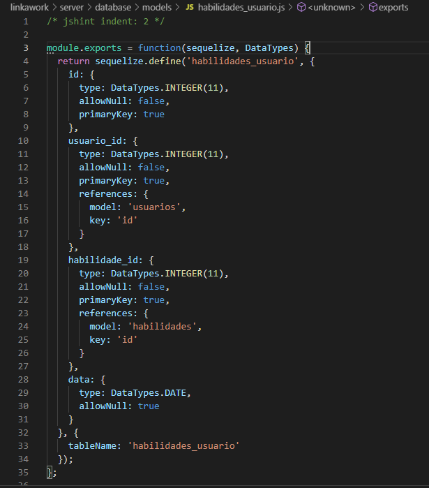
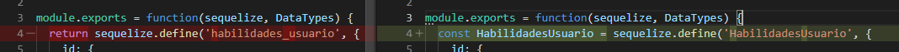
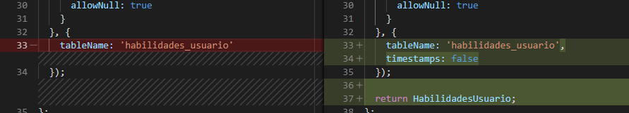
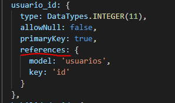
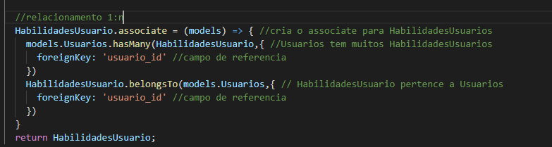

# Linkawork

Sistema para treinamento, seleção e gerenciamento de colaboradores, focado na gestão por competências

* ### [📲Front-end](#frontend)
    - ### [Comandos básicos](#comandos-front)
    - ### [📁Estrutura do projeto](#front-end-estrutura)
    - ### [Material UI](#material-ui)
    - ### [📋Formulários](#formularios)
* ### [🔧Back-end](#backend)
    - ### [Comandos básicos](#comandos-front)
    - ### [📁Estrutura do projeto](#back-end-estrutura)
    - ### [🎰Testes unitários](#testes-unitarios-back)
    - ### [💾Sequelize ORM](#sequelize)

## 📲Front-end
Guia para desenvolvimento front-end

### Comandos básicos
Instalar todos os módulos do projeto

    npm install

Rodar projeto

    npm start

### 📁Estrutura do projeto

    📁src
        📁@linka -> Componentes padrões do projeto
            📁forms -> Componentes de forms para Formsy
        📁app
            📁components -> Componentes do projeto
            📁pages -> Componentes de páginas
            📁routes -> Monta as rotas automaticamente
        📁assets -> Arquivos de imagens, icones, videos, etc.
            📁images -> Imagens que o projeto utiliza
        📁store -> Arquivos de Redux
            📁actions -> Actions de redux
            📁reducers -> Reducers de redux
        📝App.js -> Componente pai do projeto
        📝index.js -> Render do react
        📝routes.js -> Configuração de rotas e menus
        📝utils.js -> Funções uteis, validadores, etc..

### Material UI
Material UI é um módulo para React que contém components de interface gráfica, para conhecer mais sobre ele acesse o [site oficial](https://material-ui.com/).

A documentação do Material UI está disponivel no [site oficial](https://material-ui.com/).

**❗Atenção❗**
Não utilizar outros módulos de componentes sem a aprovação de todos envolvidos no projeto.

**❗Atenção❗**
O projeto utiliza a versão 3.9.2 do Material UI Core e 3.0.2 do Material UI Icons, estás versões não podem ser alteradas sem a aprovação de todos os envolvidos no projeto.

### 📋Formulários
Nos formulários é usado [Material UI](#material-ui), porém utiliza-se um outro módulo chamado [Formsy](https://github.com/christianalfoni/formsy-react), o que o Formsy faz é aplicar validação em componentes do Material UI, para fazer isso, foi necessário desenvolver novos componentes em cima de componentes do Materia UI, para isto foi criado o diretório 

    /src/@linka

**❗Atenção❗**
O projeto utiliza a versão 1.1.5 do Formsy, está versão não pode ser alterada sem a aprovação de todos os envolvidos no projeto.

## 🔧Back-end
Guia para desenvolvimento back-end

### Versões
Node: v12.13.1

### Comandos básicos
Instalar todos os módulos do projeto

    npm install

Rodar projeto

    npm run dev

### 📁Estrutura do projeto
    📁server
        📁config -> Arquivos de configuração do projeto
        📁database
            📁models -> Estrutura do banco para sequelize
        📁graphql -> resolvers para graphql
        📁models -> Modelo do banco em Sequelize
            📁validations -> Validadores personalizados para sequelize
        📁schemas -> Schema graphql, inputs, querys, mutations...
        📁tests -> Arquivos de testes unitários
        📝app.js -> Arquivo index do projeto, ele quem deve ser executado

### 🎰Testes unitários
Os testes automatizados são realizados utilizando [Jest](https://jestjs.io)

Os arquivos de testes fica no diretório tests.
O comando para rodar os testes unitários é:

    npm run test

### 💾Sequelize ORM
Para conectar ao banco de dados é utlizado o ORM Sequelize, caso não conheça acesseo site oficial do [Sequelize](https://sequelize.org/).

**❗Atenção❗**
O projeto utiliza a versão 5.15 do Sequelize, está versão não pode ser alterada sem a aprovação de todos os envolvidos no projeto.

Para utilizar o Sequelize é necessario conhece-lo, para isso utilize a [documentação oficial](https://sequelize.org/master/).

#### Mapear Tabelas
Breve tutorial de como mapear tabelas para o Sequelize utilizando [sequelize-auto](https://github.com/sequelize/sequelize-auto), verifique na documentação do [sequelize-auto](https://github.com/sequelize/sequelize-auto) como gerar models de tabelas.

✅1° - Copiar o arquivo gerado pelo sequelize-auto para a pasta models.

✅2° - Abrir o arquivo no editor de código de sua preferência.

✅3° - Trocar o nome substituindo o Underline por CamelCase e criar uma variavel para o define.

✅4° - Retornar a variavel craida acima no final da função e adicionar timestamps: false abaixo do tableName.

✅5° - Verificar se tabela precisa de associate, se tiver alguma coluna que tem references, então significa que esta coluna precisa ser associada com algo.

Para associar basta criar um associate antes do return, para mais informações sobre associate acesse a [documentação de associações](https://sequelize.org/master/manual/associations.html);

